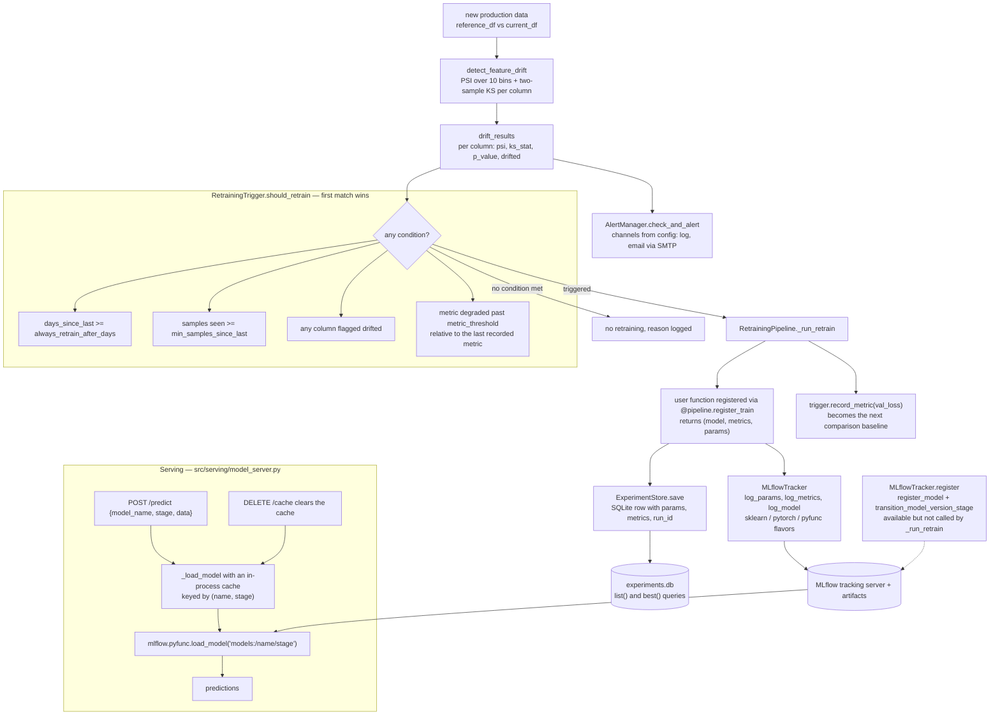

# Experiment Vault

MLflow-backed experiment registry with automated retraining triggers, PSI/KS drift detection, alert routing, and a FastAPI model-serving endpoint.

## Architecture



## Overview

- **ExperimentStore** — lightweight SQLite-backed store indexed by MLflow run IDs; `best()` returns the champion run by any metric
- **MLflowTracker** — thin wrapper + `@tracked` decorator that auto-opens/closes MLflow runs, logs params/metrics, registers model versions
- **Drift detection** — PSI (Population Stability Index) + KS two-sample test per numeric feature; prediction-distribution monitoring
- **RetrainingTrigger** — fires on: metric degradation beyond threshold, data drift, N new samples accumulated, or scheduled interval
- **RetrainingPipeline** — decorator-based orchestration: register your `train()` and `eval()` functions, call `.check()` on new data
- **Model server** — FastAPI endpoint `/predict` backed by `mlflow.pyfunc.load_model` with model-version routing

## Tech Stack

Python 3.11 · MLflow · FastAPI · scikit-learn · scipy · SQLite · pandas · pytest

## Quickstart

```bash
pip install -r requirements.txt
mlflow ui &   # http://localhost:5000

# Run tests
pytest tests/

# Start model server
uvicorn src.serving.model_server:app --reload
```

## Usage Example

```python
from src.retraining.pipeline import RetrainingPipeline

pipeline = RetrainingPipeline("configs/config.yaml")

@pipeline.register_train
def train():
    from sklearn.linear_model import LogisticRegression
    # ... load data, train model ...
    return model, {"val_loss": 0.12, "val_acc": 0.92}, {"C": 1.0, "model_type": "lr"}

# Check for drift / trigger retraining
pipeline.check(reference_df=ref, current_df=cur, current_metric=0.18, days_since_last=35)
```

## Evaluation

The platform tracks model and data-health metrics rather than computing task-specific metrics directly. User-supplied `train()` and `eval()` functions return a metrics dict that is logged to MLflow and persisted in `ExperimentStore`. Champion selection uses `ExperimentStore.best(metric, mode)`.

Built-in monitoring metrics computed by `src/monitoring/drift_detector.py`:

| Metric | What it measures | How to compute |
|--------|------------------|----------------|
| PSI (Population Stability Index) | Distribution shift per numeric feature between reference and current | `detect_feature_drift(ref_df, cur_df)` returns per-column PSI; threshold from `configs/config.yaml` |
| KS two-sample statistic + p-value | Non-parametric drift per numeric feature | Same call; uses `scipy.stats.ks_2samp` |
| Prediction-distribution drift | PSI on model output distribution | Pass model predictions as a single-column frame to the same detector |
| Metric degradation | Drop in champion metric vs. baseline | `RetrainingTrigger.should_retrain(current_metric=...)` with `metric_drop_threshold` from config |

Tests under `tests/test_drift.py` exercise the PSI/KS implementation with synthetic shifted distributions; `tests/test_trigger.py` covers retraining trigger logic; `tests/test_store.py` covers champion selection.

## Project Structure

```
experiment_vault/
├── src/
│   ├── registry/     # experiment_store.py, mlflow_tracker.py
│   ├── monitoring/   # drift_detector.py, alerts.py
│   ├── retraining/   # trigger.py, pipeline.py
│   └── serving/      # model_server.py (FastAPI)
├── configs/          # config.yaml
└── tests/            # pytest suite
```
